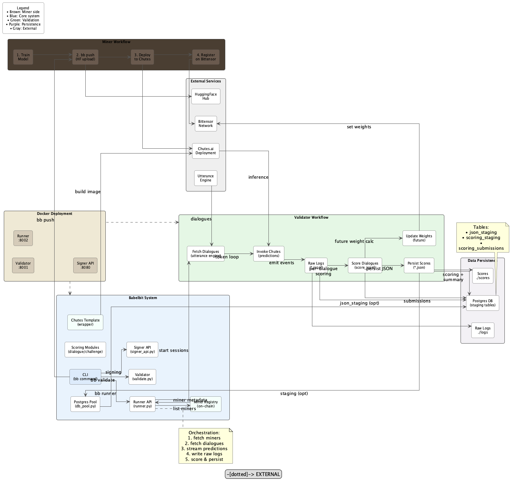

# BabelBit

## What is Babelbit?
### Background Theory
Babelbit is a subnet which is developing low-latency speech-to-speech translation. We are working on the principle that as well as all the latency which is caused by speech encoding and synthesis, there have traditionally been hard limits on the latency of translating the language itself. That is, it is often not clear what a sentence means until you have the whole thing. This is especially true with languages where the word order rules put the verb at the end of a clause, like German, or sometimes the end of a sentence, in dialects like this example in Swiss German:

*Ich ha s Schlos, wo ich, wie so oft, z'heftig, i mim Stress, wo wider mau passiert isch, verdräit ha, ufbroche.*

which means:

*I broke the lock, turning it too hard, in my usual panic*

but is articulated something like:

*I have, the lock, which I, as so often, too forcefully, in my panic, again, turned have, broken.*

That is, **the listener has no idea what the sentence is about (breaking a lock) until the very last word**. 

### Our Hypothesis
When native speakers listen to sentences with the verb at the end, in the vast majority of cases, they know what it will be. LLMs work in exactly the same way. In fact the fundamental mechanism by which they appear to exhibit intelligence is in predicting the best possible work to come next given the prior context. We are going to stretch this predictive power to its absolute limits, so that we can guess from the context what speaker is about to say, and start translating earlier. 

## Our First Challenge
- it doesn't involve speech
- it doesn't involve translation
- **What????**

Our first job it develop the prediction technique. So the challenge involves predicting not just the next word, but the entire phrase or sentence, and predicting it again, each time a word is revealed.

What's more, **the best answer might not have all the words right**

Remember that our predictions are part of a translation system. So if your script makes a prediction which *means* the same as the input, it can score very highly. Translating a sentence which means the same as what was said is just as good as tranlating the original, especially if it can be output much more quickly, e.g. 

INPUT: Hi - how is all going with you?

REVEALED PART OF THE INPUT: Hi - how....

PREDICTION: Hi - how are you?

Would it matter if we translated "how are you?" insteadn of "how is all going with you?"

So first we must master the art of making predictions which are similar, whether that is *lexically* or *semantically* similar. If we can get a semantically adequate prediction *much* earlier than we could if we waited for the whole input, we can reduce translation latency by a huge degree. 

You can improve our script; improve our model; replace the model with your own better one; retrain a new open-source model you just heard about. 

Knock yourselves out. This is a creative field, in which the winners will be making a gigantic contribution to technology. 

We have just added **one million utterances** of test data in a free repository:

https://github.com/babelbit/miner-test-data

This is all formatted to work with the test tools, and uses the same JSON schema as the validation data. 


# Setup 
## Bittensor
Get a Bittensor wallet

### Install bittensor cli
```bash
pip install bittensor-cli
```

### Create a coldkey (your main wallet)
```bash
btcli wallet new_coldkey --n_words 24 --wallet.name my-wallet
```

### Create a hotkey (for signing transactions)

```bash
btcli wallet new_hotkey --wallet.name my-wallet --n_words 24 --wallet.hotkey my-hotkey
```

### Update your .env file
```bash
cat >> .env << 'EOF'
BITTENSOR_WALLET_COLD=coldkey
BITTENSOR_WALLET_HOT=my-hotkey
BITTENSOR_WALLET_PATH=path-~/.bittensor/wallets/my-wallet/hotkeys/my-hotkey
EOF
```

## Chutes 

### Install chutes cli
`pip install -U chutes`

### Register your account
`chutes register`

Follow the interactive prompts to:

- Enter your desired username
- Select your Bittensor wallet
- Choose your hotkey
- Complete the registration process (note your unique fingerprint)

### Create an API key
- Log into chutes website (via your fingerprint)
- Create an API token 

### Update your .env file
```bash
cat >> .env << 'EOF'
CHUTES_USERNAME=your-username
CHUTES_API_KEY=your-api-key
EOF
```

## Huggingface
- Create a Huggingface account and sign in
- Create a token

### Update your .env file
```bash
cat >> .env << 'EOF'
HUGGINGFACE_USERNAME=your-username
HUGGINGFACE_API_KEY=your-api-key
EOF
```

# BabelBit Architecture


# Validators

## Postgres Database

Validators will need to create their own Postgres database to persist miner scores. If you host DB's on windows or you prefer a manual sql schema to create the schema then please defer to the file manual_db_bb_schema.sql 

You can run the following command to create the schemas in your database:

```bash
psql -h YOUR_PG_HOST -p YOUR_PG_PORT -U YOUR_PG_USER -d YOUR_PG_DB -f sql/init.sql
```

### Update your .env file
```bash
cat >> .env << 'EOF'
PG_HOST=your-pg-host
PG_PORT=your-pg-port
PG_DB=your-pg-db-name
PG_USER=your-pg-user 
PG_PASSWORD=your-pg-password
EOF
```

## S3 Bucket (optional)

Logs created by the validator can be stored in a S3 bucket for later use. This step is optional and won't affect the output of the validator.

### Update your .env file
```bash
cat >> .env << 'EOF'
BB_ENABLE_S3_UPLOADS=1
S3_ENDPOINT_URL=your-s3-endpoint-url
S3_REGION=s3-region
S3_ACCESS_KEY_ID=your-s3-access-key
S3_SECRET_ACCESS_KEY=your-s3-secret
S3_BUCKET_NAME=your-s3-bucket
S3_CHALLENGES_DIR=challenges
S3_LOG_DIR=logs
S3_ADDRESSING_STYLE=s3-addressing-style-used-by-your-cloud-provider
S3_SIGNATURE_VERSION=s3-signature-version
S3_USE_SSL=true-or-false
EOF
```

## Running the validator

(Recommended): Run the validator with docker.
```bash
docker compose down && docker compose pull 
docker compose up --build -d && docker compose logs -f
```

(Optional): Run the validator locally
```bash
sv -vv validate
sv -vv runner
sv -vv signer
```


# Miners

0. Install Babelbit CLI (uv)

```bash
# Install uv
curl -LsSf https://astral.sh/uv/install.sh | sh

# setup
uv venv && source .venv/bin/activate
uv sync  # install deps

# verify installation
bb
```

1. Register with the Subnet 
Register your miner to BabelBit (SNXX).
```bash
btcli subnet register --wallet.name <your cold> --wallet.hotkey <your hot>
```

2. Upgrade Chutes to a Developer-Enable Account
Miners need a chutes developer account ( `chutes.ai` ). 

IMPORTANT: you require a ***developer enabled account*** on Chutes to mine. Normal API keys cannot deploy chutes right now.

3. Train a model
```bash
... magic ML stuff ...
```

4. Modify how the model will be deployed on Chutes
Before you push your model, you can customise how it is loaded in on chutes and handles predictions

- `babelbit/chute_template/setup.py`
- `babelbit/chute_template/load.py`
- `babelbit/chute_template/predict.py`

It is highly recommended to build the chute locally after any changes to check for errors. Steps to build locally:
- (optional) ssh onto a machine with the specs matching your requirements (e.g. GPU, etc)
- ensure your `~/.chutes/config.ini` file is present on the machine (generated automatically when you register with chutes)
- install docker and chutes 
- generate the python script containing your chute called "my_chutes.py" via `bb -v generate-chute-script --revision your-hf-sha`
- run `chutes build my_chutes:chute --local --public`
- `docker images`
- run the image you just built and enter it `docker run -p 8000:8000 -it <image-name> /bin/bash` 
- when inside the container: `export CHUTES_EXECUTION_CONTEXT=REMOTE` and run `chutes run my_chute:chute --dev --debug`
- query the endpoints from outside the container

5. Push the model to your miner
Once you are happy with the changes, push your model to Huggingface Hub and then deploy it to Chutes and onto Bittensor with the following command:

```bash
bb -vv push --model_path <i.e. ./my_model>
```

Note the hugginface repo revision and chute slug from the logs. If you missed it you can get the revision directly from your HF account and you can use this to get your chute-slug and ID:
```bash
bb -v chute-slug --revision your-huggingface-repo-sha
```

(Be careful, you only have a limited number of uploads per 24hours)

6. Test it live
Soon your model will be hot on chutes. You can check that using 
```bash
chutes chutes list
```

You can test the /health and /predict endpoints using a fake challenge payload like so:

```bash 
bb -v ping-chute --revision your-huggingface-repo-sha
``` 


If you are finding problems with your live chute, you can view its logs like so:
- log into chutes via the browser (use your fingerprint)
- find the chute "My Chutes"
- go to the "Statistics" tab
- note down the instance-id
- query the logs via the api: `curl -XGET https://api.chutes.ai/instances/<CHUTE-INSTANCE-ID>/logs -H "Authorization: <CHUTES-API-KEY>"`

1. Delete old models (optional)
You can remove an old version of your model from chutes if desired
```bash
bb -v delete-chute --revision your-old-huggingface-repo-sha 
```


